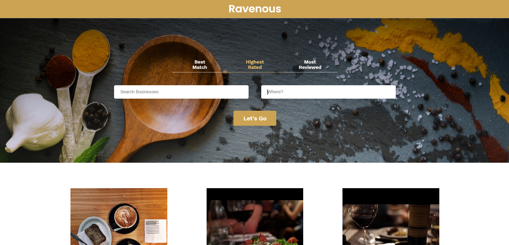
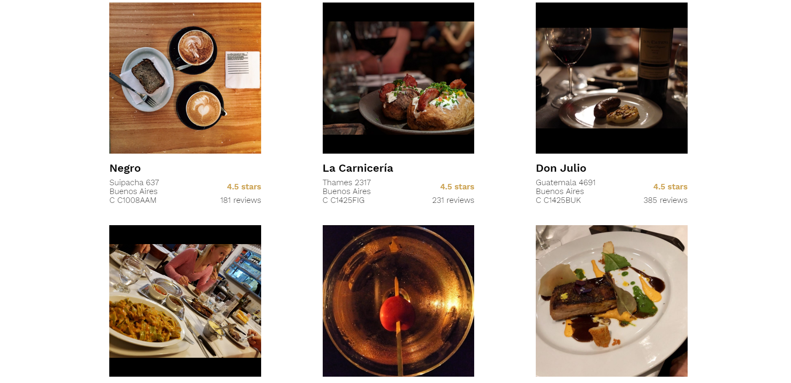

# Ravenous
> A mobile responsive [React](https://github.com/facebook/react) app for searching businesses around the world and see their info. Live app: https://ravenous-c7275.web.app/.


## Table of contents

* [General info](#general-info)
* [Screenshots](#screenshots)
* [Technologies](#technologies)
* [Setup](#setup)
* [Features](#features)
* [Status](#status)
* [Inspiration](#inspiration)
* [Contact](#contact)


## General info

This project was coded to learn [React](https://github.com/facebook/react) best practices and patterns, and interact with a 3rd party API.


## Screenshots

Image#1: Home screen




Image#2:  Login/Sign Up screen




Image#3: Checkout screen


## Technologies

* [React](https://github.com/facebook/react) - version 16.12.0
* [Yelp API](https://www.yelp.com/developers)


## Setup

* **Clone or download the repo.**

* **Install all the dependencies** listed on the`package.json` file by running:

  ```bash
  npm install
  ```

* **Run the app in the development mode.**

  In the project directory, you can run:  

  ```bash
  npm start
  ```

  Open [http://localhost:3000](http://localhost:3000) to view it in the browser.

  The page will reload if you make edits.

  You will also see any lint errors in the console.

* **Launch the test runner in the interactive watch mode:**

  ```bash
  npm test
  ```

  See the section about [running tests](https://facebook.github.io/create-react-app/docs/running-tests) for more information.

* **Build the app for production to the `build` folder:**

  ````bash
  npm run build
  ````

  It correctly bundles React in production mode and optimizes the build for the best performance.

  The build is minified and the filenames include the hashes.

  Your app is ready to be deployed!

  See the section about [deployment](https://facebook.github.io/create-react-app/docs/deployment) for more information.

* **If you aren’t satisfied with the build tool and configuration choices**:

  ````bash
  npm run eject
  ````

  **Note: this is a one-way operation. Once you `eject`, you can’t go back!**

  If you aren’t satisfied with the build tool and configuration choices, you can `eject` at any time. This command will remove the single build dependency from your project.

  Instead, it will copy all the configuration files and the transitive dependencies (webpack, Babel, ESLint, etc) right into your project so you have full control over them. All of the commands except `eject` will still work, but they will point to the copied scripts so you can tweak them. At this point you’re on your own.

  You don’t have to ever use `eject`. The curated feature set is suitable for small and middle deployments, and you shouldn’t feel obligated to use this feature. However we understand that this tool wouldn’t be useful if you couldn’t customize it when you are ready for it.


## Features
List of implemented features:
* Search by business type and location

List of improvements that could be done:

* When pressing the `enter` key, the search should be triggered.
* When clicking on the `Best Match`, `Highest Rated`, and `Most Reviewed` options, the call to the API should be triggered automatically, without the need of clicking the `Let's Go` button.


## Status

Project is _finished_. 


## Inspiration

This project was based on [CodeCademy's Web Development career path](https://www.codecademy.com/learn/paths/web-development).


## Contact

Created by [Esteban Munch Jones](https://www.linkedin.com/in/estebanmunchjones/)- feel free to contact me.

